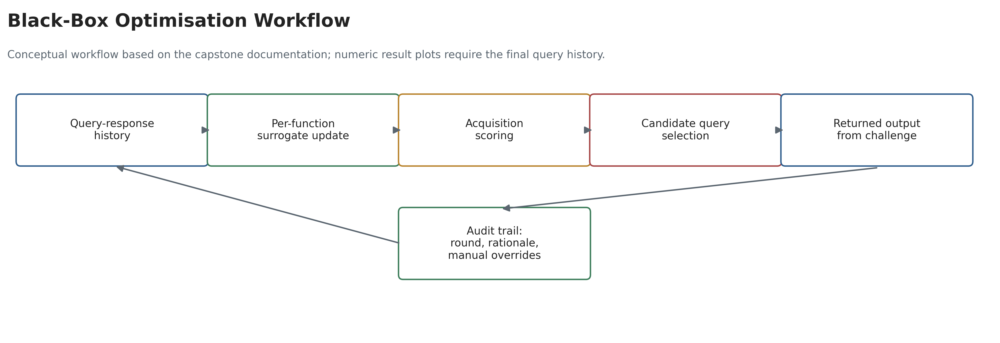
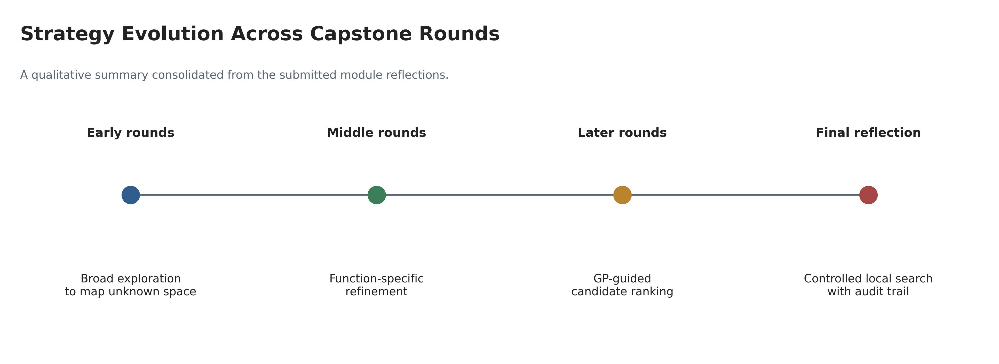

# Black-Box Optimisation Capstone Project

This repository contains the final GitHub portfolio version of my Imperial College Professional Certificate capstone project. The project focuses on a black-box optimisation (BBO) challenge: choosing query points for unknown functions when the internal formula, gradient and response surface are hidden.

The goal is to make each query informative, improve the best observed function values, and explain the reasoning behind each decision in a way that is reproducible and reviewable.

## Background and Business Problem

Many machine learning and business problems involve optimising an objective that is expensive or opaque. Examples include hyperparameter tuning, pricing tests, A/B experiments, product configuration, industrial process tuning, audit analytics and risk-model threshold selection. In these settings, the decision-maker does not know the true response function and may only be able to observe one result at a time.

The capstone challenge mirrors this situation. For each unknown function, I submit a query vector and receive a scalar output. The objective is to maximise the outputs while using a limited number of queries. The key project challenge is the exploration-exploitation trade-off: deciding when to search uncertain areas and when to refine areas that already look promising.

## Dataset

The working dataset is an iterative query-response log from the BBO challenge.

| Item | Description |
| --- | --- |
| Unit of observation | One submitted query for one black-box function |
| Functions | Eight unknown functions, each treated as its own optimisation problem |
| Inputs | Numeric query vector values between 0 and 1 |
| Input format | Hyphen-separated values with six decimal places, for example `0.123456-0.654321` |
| Output | One scalar function value returned by the challenge system |
| Local raw path | `data/raw/bbo_query_history.csv` |
| Shareable schema | `data/sample/bbo_query_history_template.csv` |

The raw challenge data and final query results are not currently committed. Add the local query history file under `data/raw/` to reproduce the notebook workflow. The repository keeps only a schema template so that large, restricted or assessment-specific data is not accidentally published.

Expected query history columns:

| Column | Purpose |
| --- | --- |
| `function_id` | Identifier for the black-box function |
| `round` | Submission round or iteration number |
| `query` | Hyphen-separated query vector |
| `output` | Returned scalar value |
| `notes` | Optional reasoning or context for the query |

## Project Objectives

- Maximise each unknown black-box function under a limited query budget.
- Build a transparent optimisation process that can be reviewed by another practitioner.
- Balance broad exploration, local refinement and uncertainty-aware model guidance.
- Compare simple heuristics with model-based strategies such as Gaussian Process surrogate modelling.
- Document assumptions, limitations and responsible-use considerations clearly.

## Machine Learning Approach

The project evolved across the module submissions:

| Stage | Strategy |
| --- | --- |
| Early rounds | Broad exploration to map the search space and avoid premature assumptions |
| Middle rounds | Per-function strategy, using observed outputs to identify promising regions |
| Later rounds | Controlled local refinement around strong points, with exploration reserved for uncertain or under-sampled regions |
| Final reflection | Evidence-based optimisation, duplicate checking, conservative step-size control and clearer documentation of assumptions |

The main technical approach is Bayesian optimisation using a Gaussian Process surrogate model. Gaussian Processes are suitable here because the dataset is small and each function evaluation is valuable. The surrogate model estimates both predicted output and uncertainty. Acquisition rules such as Expected Improvement and Upper Confidence Bound then help decide whether the next query should exploit a strong region or explore an uncertain one.

Support Vector Machines and neural networks were considered as supporting ideas. SVMs can help classify regions as high-performing or low-performing if the problem is reframed as classification. Neural networks may be useful for higher-dimensional surrogate modelling, but they require more data and tuning, so they are not the primary model for the current small-data setting.

## Preprocessing

The reproducible workflow should:

- Validate that every query value is numeric and within `[0, 1]`.
- Parse hyphen-separated query strings into numeric feature columns.
- Keep query histories separated by `function_id`.
- Check for duplicate or near-duplicate query points.
- Preserve the sequence of rounds because later decisions depend on earlier results.
- Avoid a standard random train/test split when evaluating optimisation performance; this is a sequential decision problem, not a conventional supervised prediction task.

## Exploratory Data Analysis

The notebook is designed to inspect:

- Query counts by function and round.
- Best observed output per function.
- Best-so-far improvement over time.
- Output distributions and possible noisy or unstable functions.
- Candidate clusters, boundary regions and local refinements.
- Functions that may require more exploration because evidence remains sparse.

## Models Tested or Considered

| Method | Role in the project |
| --- | --- |
| Manual heuristic search | Initial baseline for broad exploration and controlled local movement |
| Gaussian Process regression | Primary surrogate model for small-data, uncertainty-aware optimisation |
| Expected Improvement | Acquisition rule for finding points likely to improve on the current best |
| Upper Confidence Bound | Acquisition rule for balancing predicted value and uncertainty |
| SVM with RBF kernel | Possible supporting classifier for high-performing versus low-performing regions |
| Neural network surrogate | Future option for higher-dimensional or larger query histories |

## Evaluation Metrics

Because this is an optimisation challenge, success is not measured by classification accuracy. The most relevant metrics are:

- Best observed output for each function.
- Improvement in best-so-far output across rounds.
- Query efficiency, measured by improvement per query.
- Stability of improvement near promising regions.
- Duplicate avoidance and coverage of under-sampled regions.
- Quality of reasoning behind each query choice.

The repository does not yet contain the final numeric score table. Once the final query history is added, the notebook can compute best-so-far curves and summary metrics automatically.

## Figures and Visualisations

The committed figures are documentation visuals generated from the consolidated capstone narrative. They do not claim numeric model performance.



The workflow figure shows the intended BBO loop: update the query-response history, fit a per-function surrogate, score candidate points, submit a query, log the returned output and preserve the reasoning trail.



The strategy-evolution figure summarises the qualitative progression documented across the module submissions: broad exploration, per-function refinement, Gaussian Process guided candidate ranking and controlled local search with auditability.

Data-dependent result figures are generated by `notebooks/BBO_Capstone_Method_and_Results.ipynb` when `data/raw/bbo_query_history.csv` is available:

| Figure | Status | Source |
| --- | --- | --- |
| `figures/best_so_far_by_round.png` | Pending raw query history | Notebook section 4 |
| `figures/output_distribution_by_function.png` | Pending raw query history | Notebook section 4 |

## Key Results and Conclusion

The strongest conclusion from the submitted capstone reflections is that successful BBO strategy was adaptive rather than one-size-fits-all. Early exploration helped reduce uncertainty, but later rounds benefited from treating each function separately, refining stable high-performing regions, and keeping controlled exploration for noisy or unclear functions.

The final portfolio repository therefore presents the project as an iterative optimisation workflow rather than a generic supervised learning exercise. The main result is a reproducible structure for documenting query history, fitting small-data surrogate models, ranking candidate queries and explaining the exploration-exploitation decision process.

## Limitations

- The final query history and returned output table are not currently committed.
- Some conclusions are qualitative because the numeric results are not available in the repository.
- The functions may be noisy, non-linear, discontinuous or multimodal, so local refinement can be misleading.
- Higher-dimensional functions remain sparse even after several rounds.
- Manual judgement was used in parts of the strategy, which should be documented alongside any model-based recommendation.

## Future Improvements

- Add the complete final query-response log if permitted by the assessment rules.
- Export best-so-far plots and final score summaries into `figures/` and `reports/`.
- Add duplicate-distance checks before each submitted query.
- Compare Expected Improvement, UCB and random-search baselines on the same history.
- Investigate trust-region Bayesian optimisation for higher-dimensional functions.
- Consider BoTorch, GPyTorch or neural network surrogates if the dataset grows large enough to justify the added complexity.

## Repository Structure

| Path | Purpose |
| --- | --- |
| `README.md` | Main project overview and reproducibility guide |
| `notebooks/BBO_Capstone_Method_and_Results.ipynb` | Clean notebook scaffold for the BBO workflow |
| `src/bbo_utils.py` | Reusable helpers for query parsing, Gaussian Process fitting and acquisition scoring |
| `data/README.md` | Data access and local file layout guidance |
| `data/sample/bbo_query_history_template.csv` | Shareable schema for the expected query log |
| `docs/BBO_Capstone_Datasheet.md` | Dataset documentation and responsible-use notes |
| `docs/BBO_Capstone_Model_Card.md` | Model card for the BBO surrogate workflow |
| `docs/BBO_Technical_Foundations.md` | Technical summary of Gaussian Processes, acquisition functions and strategy evolution |
| `scripts/generate_documentation_figures.py` | Script for regenerating committed documentation figures |
| `queries/` | Suggested location for submitted query records |
| `figures/` | Documentation visuals and data-dependent result plots |
| `reports/` | Suggested location for final score summaries and analysis outputs |
| `models/` | Suggested location for local model artifacts, not committed by default |
| `presentation/` | Presentation notes or links |
| `requirements.txt` | Python dependencies |

## How to Run the Project

Create and activate a virtual environment:

```bash
python -m venv .venv
.venv\Scripts\activate
pip install -r requirements.txt
```

For macOS or Linux:

```bash
source .venv/bin/activate
```

Add the raw query history locally:

```text
data/raw/bbo_query_history.csv
```

Then open the notebook:

```bash
jupyter notebook notebooks/BBO_Capstone_Method_and_Results.ipynb
```

To execute the notebook from the command line:

```bash
python -m nbconvert --to notebook --execute notebooks/BBO_Capstone_Method_and_Results.ipynb --inplace
```

To regenerate the committed documentation figures:

```bash
python scripts/generate_documentation_figures.py
```

## References

- Rasmussen and Williams, *Gaussian Processes for Machine Learning*.
- Jones, Schonlau and Welch, *Efficient Global Optimization of Expensive Black-Box Functions*.
- Srinivas et al., *Gaussian Process Optimization in the Bandit Setting*.
- Snoek, Larochelle and Adams, *Practical Bayesian Optimization of Machine Learning Algorithms*.
